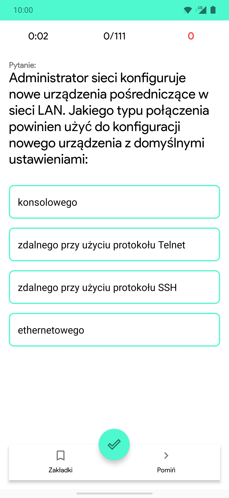
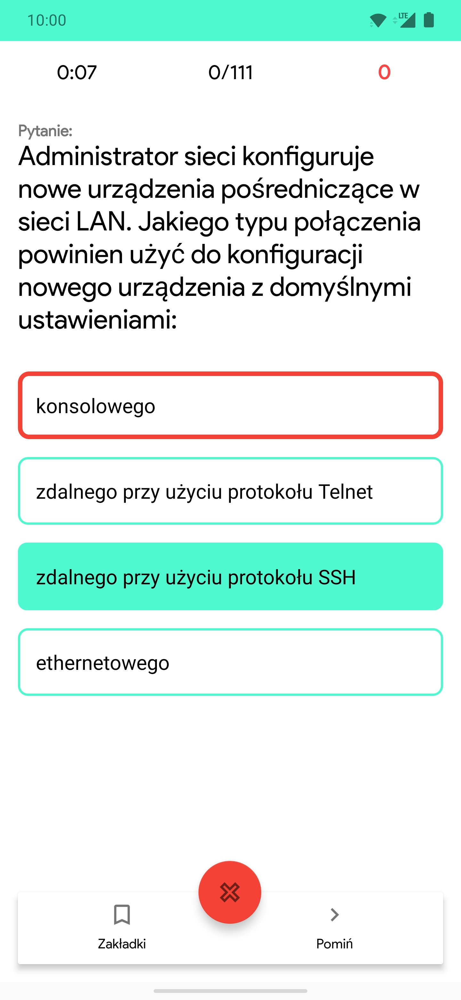
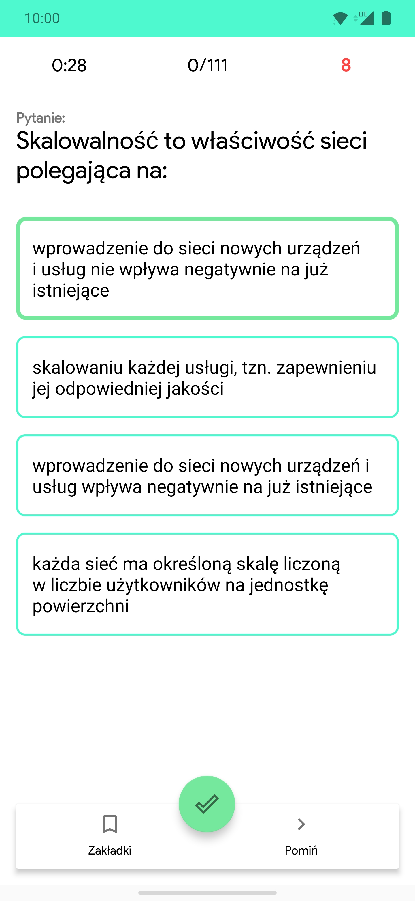

# Testo - solve tests/quizes on-the-go
WIP Android app for solving tests from existing question databases.  
API >= 26 (Android 8.0), written in Kotlin.
# Screenshots
<div style="display:flex;">



</div>

# Limitations
* Only in-app database is available
* Accepts only text databases

# Usage
## a) Use existing question database
Use [this converter](https://github.com/lutyjj/baza-to-db) to convert existing **text** databases to SQLiteDB.  
Replace database from /assets/databases/ with the one you want to use.
## b) Create your own question database
```sql
CREATE TABLE "Questions" (
	"question_id"	INTEGER NOT NULL,
	"title"	TEXT,
	PRIMARY KEY("question_id")
);

CREATE TABLE "Answers" (
	"question_id"	INTEGER,
	"answer_text"	TEXT,
	"is_correct"	INTEGER,
	FOREIGN KEY("question_id") REFERENCES "Questions"("question_id")
);
```
Replace database from /assets/databases/ with the one you want to use.
# Todo
In priority order:
* Question repeat counter
* Allow custom databases
* Allow pictures in databases
* Download up-to-date databases directly from repositories
* Create missing activities / finish UI 
* On-device conversion of existing databases from .txts
